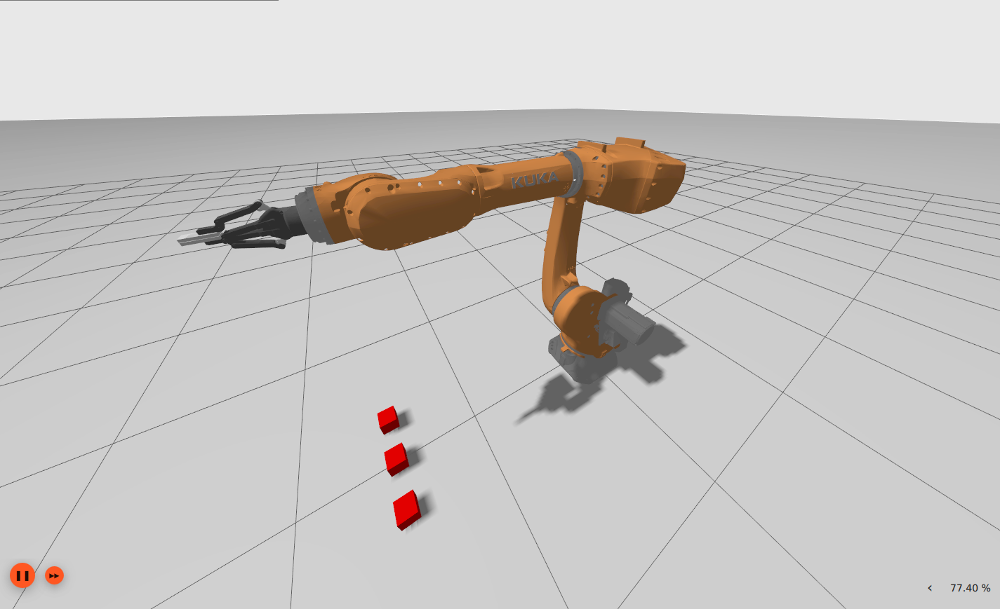

# KUKA ROS2 Pick and Place Project

This project implements a pick-and-place pipeline using the **KUKA KR70 R2100** industrial robot with a **Robotiq 2F-140** gripper in **ROS 2 Humble** and **MoveIt 2**, simulated in **Gazebo Fortress**.

## installation
### 1.Clone the repo to your workspace
```bash
git clone https://github.com/Erfanniazi39/KUKA-ROS2-PICK-AND-PLACE.git
cd KUKA-ROS2-PICK-AND-PLACE
```

### 2.Install Dependecies
Ensure you have all necessary dependencies installed:

```bash
sudo apt update
sudo apt install ros-humble-moveit
sudo sudo apt install ros-humble-ros-gz
sudo apt-get install ros-humble-ign-ros2-control
```

### 3.Build your workspace

```bash
source /opt/ros/humble/setup.bash
cd ~/your_ros2_workspace
colcon build
source install/setup.bash
```

## Usage

### Launch the simulation 
```bash
ros2 launch kuka_gazebo kuka_bringup.launch.py
```



### For pick and place object

```bash
cd ~/your_ros2_worksspace/src/KUKA-ROS-PICK-AND-PLACE/kuka_control/control_scripts/scripts
python3 action_execution.py
```


